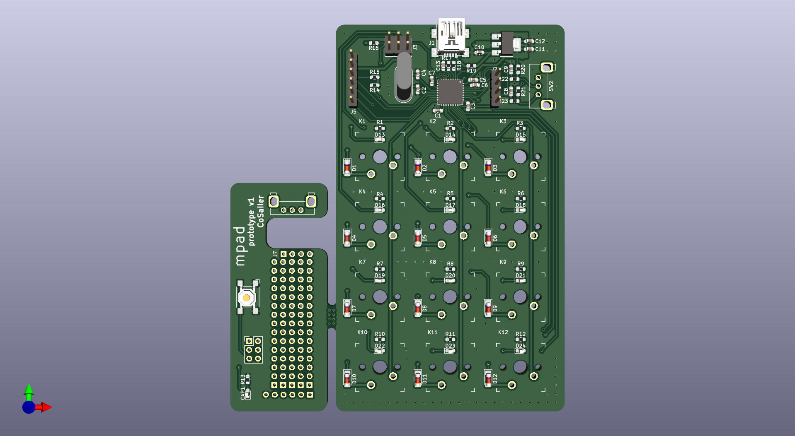
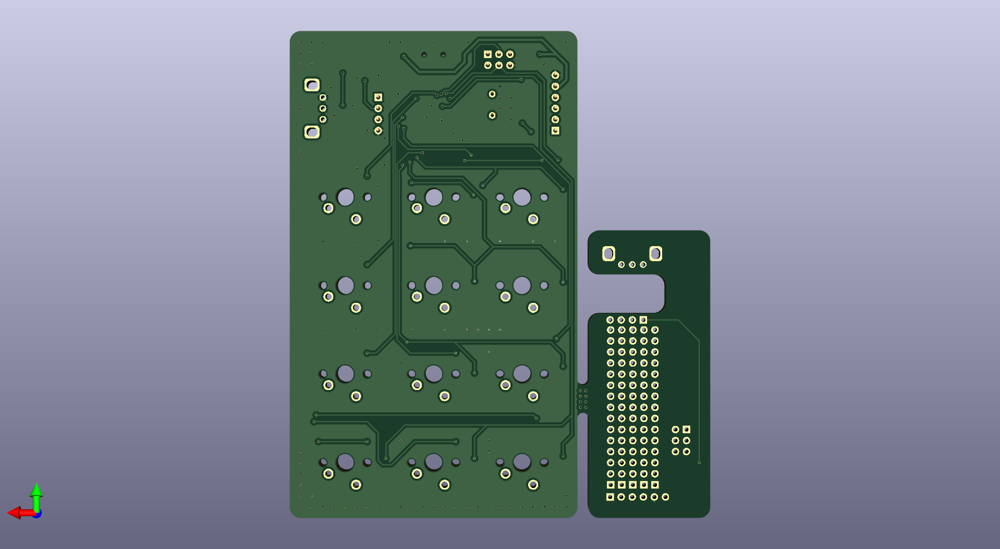

# mpad
**>> info**\
a 12 key macropad designed with atmega32u4, compatible with QMK, which is built with **virtser** and **I2C** enabled. the virtual serial port is used to control the 12 onboard backlight led, the I2C bus has a gesture sensor APDS-9960 connected to detect hand movement direction(up/down/left/right/near/far), proximity and light intensity. there is also a mouse encoder mounted.

**>> files**\
**mpad** :KiCad design files\
**qmk_firmware\keyboards\mpad** : firmware source for qmk build system\
**mpad.py** : a python test script to control the backlight LED via serial port\
**register_dump.txt** : an example register dump for APDS-9960

**>> setup**\
1, pin assignment, left: key and matrix assignment, right: backlight pin assignment
```
        D5     D4     D6       0,F5
     ┌──────┬──────┬──────┐
  B4 │ ESC  │ CALC │ MYCM │    1,B2   2,B1   3,B0
     ├──────┼──────┼──────┤
  B5 │ Ctl+C│ DEL  │ BSPC │    4,B3   5,F6   6,E6
     ├──────┼──────┼──────┤
  B6 │ SPACE│  Up  │  ENT │    7,F7   8,D7   9,F4
     ├──────┼──────┼──────┤
  B7 │ Left │ Down │ Right│   10,C6  11,C7  12,E2
     └──────┴──────┴──────┘
```

2, the onboard gesture sensor APDS-9960 is installed horizontally, the down movement is mapped to left key, up => right key, left => up key, right => down key

3, the 12 key individual backlight(single color) can be controlled from PC or mcu directly, allows it to be a LED notification light

the communication protocol: (each [xx] corresponds to 1 byte)
```
cmd 1: [0xAA] [ B1 ] [ B2 ] [0xE1] : set back light   ACK 1:[0xE1] ['\n']
cmd 2: [0xAA] [0xE2] : request timer                  ACK 2:[0xE2] [ T1 ] [ T2 ] [ T3 ] [ T4 ] ['\n']
cmd 3: [0xAA] [0xE3] : request voltage                ACK 3:[0xE3] [ U1 ] [ U2 ] ['\n']
cmd 4: [0xAA] [0xE4] : request die_temp               ACK 4:[0xE4] [ D1 ] [ D2 ] ['\n']
cmd 5: [0xAA] [0xE5] : request proximity              ACK 5:[0xE5] [ P1 ] ['\n']
cmd 6: [0xAA] [0xE6] : request light                  ACK 6:[0xE6] [ L1 ] [ L2 ] ['\n']
```
the script **mpad.py** sends commands to mpad every 100ms, to control the backlight LED and request some other system information. 

4, an onboard mouse encoder is mapped to volume control, which can be controlled via one finger

**>> PCB**\
the PCB is designed with KiCad 7.07. with the addition of an encoder, the PCB height size has grown over the 100mm. a small daughter board is attached to mount the gesture sensor and the encoder, the daughter board also has some extra room to mount other I2C sensors.




**>> notes**\
1, even with interrupt enabled, the driver for the APDS-9960 still needs hundreds of milliseconds to measure/calculate the direction of the movements, during this time the keypad will not respond to other inputs, this is the limitation of the sensor.

2, apart from normal movement direction detection, another gesture is also possible: **proximity tap** within a predfined time window (e.g. 1.5 seconds), it could be one tap, two taps or more taps. but proximity tap cannot be enabled togethe with the normal gesture detection.

3, the APDS-9960 interrupt is active low.

4, the serial port in qmk running on atmega32u4 can only process the received data one byte a time, so that it does not block normal keyboard functions.

**>> refernces**\
1, https://qmk.fm \
2, https://github.com/njeff/cherryblossom \
3, https://www.broadcom.com/products/optical-sensors/integrated-ambient-light-and-proximity-sensors/apds-9960 \
4, https://learn.sparkfun.com/tutorials/apds-9960-rgb-and-gesture-sensor-hookup-guide/all


